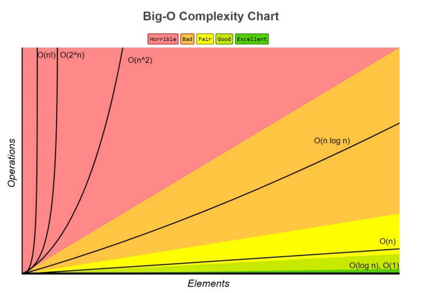

# data-structures-and-algorithms
Data Structures And Algorithms

# Algorithm
- An algorithm is a set of well-defined instructions to solve a particular problem
- Learning algorithms translates to learning different technique to efficiently solve those problems

# Measuring performace

# Time & Space complexity
> Time complexity: Amount of time taken by an algorithm to run, as a function of input size

> Space complexity: Amount of memory taken by an algorithm to run, as a function of input size

# Big O notation
- The worst case complexity of an algorithm is represented using Big-O notation
- Bif-O notation describes the complexity of an algorithm using algebraic terms

## Time Complexity
- O(1) - Constant
- O(n) - Linear
- O(n^2) - Quadratic
- O(n^3) - Cubic
- O(log n) - Logarithmic - Input size reduces by half every iteration

[Big-O Complexity Chart](https://www.bigocheatsheet.com/)

## Big-O
- O(1) Calculation not dependent on input size
- O(n) 1 loop
- O(n^2) 2 nested loops
- O(log n) Input size reduced by half

## Analogy